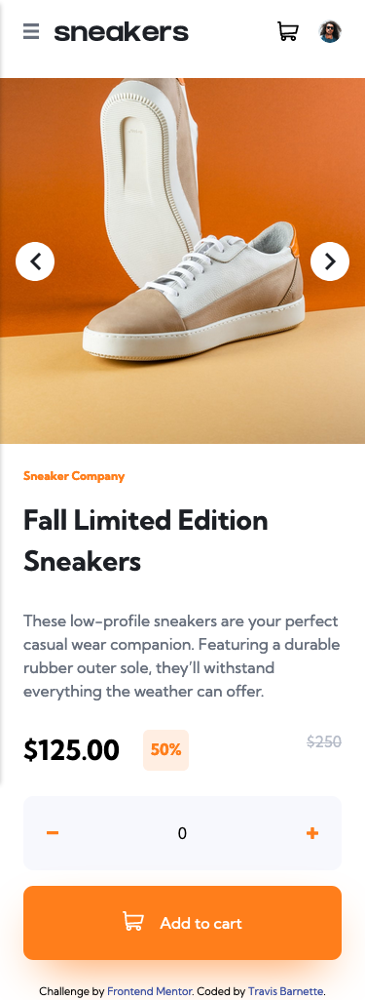

# Frontend Mentor - E-commerce product page solution

This is a solution to the [E-commerce product page challenge on Frontend Mentor](https://www.frontendmentor.io/challenges/ecommerce-product-page-UPsZ9MJp6). Frontend Mentor challenges help you improve your coding skills by building realistic projects.

## Table of contents

- [Overview](#overview)
  - [The challenge](#the-challenge)
  - [Screenshot](#screenshot)
  - [Links](#links)
- [My process](#my-process)
  - [Built with](#built-with)
  - [What I learned](#what-i-learned)
  - [Continued development](#continued-development)
 
- [Author](#author)

## Overview

### The challenge

Users should be able to:

- View the optimal layout for the site depending on their device's screen size
- See hover states for all interactive elements on the page
- Open a lightbox gallery by clicking on the large product image
- Switch the large product image by clicking on the small thumbnail images
- Add items to the cart
- View the cart and remove items from it

### Screenshots

### Links

- Solution URL: [Add solution URL here](https://github.com/barnettet31/ecommerce-product-page-main)
- Live Site URL: [Add live site URL here](https://barnettet31.github.io/ecommerce-product-page-main/)

## My process

I started by laying out the project as if all of the active features were present, shopping cart, nav menu, item count etc. 

Then hid the elements as a default, and had javascript add a --active class to see them as expected! I kept track of what was in the shopping cart by means of a custom class

### Built with

- Semantic HTML5 markup
- CSS custom properties
- Flexbox
- CSS Grid
- Mobile-first workflow

### What I learned

I was really trying to start to take advantage of the Class syntax  in Javascript and what you can do with those on page load. 

To see how you can add code snippets, see below:

### Continued development

My continued development will start to include css and js libraries so I can remove some of the fussing over what I consider minor parts of code that I understand fairly well at this point. 

## Author

- Frontend Mentor - [@yourusername](https://www.frontendmentor.io/profile/barnettet31)
- Twitter - [@yourusername](https://twitter.com/barnett_travis5)

